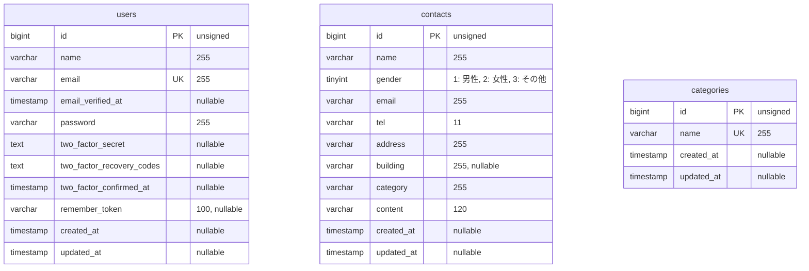
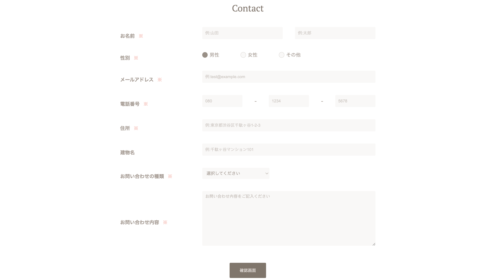
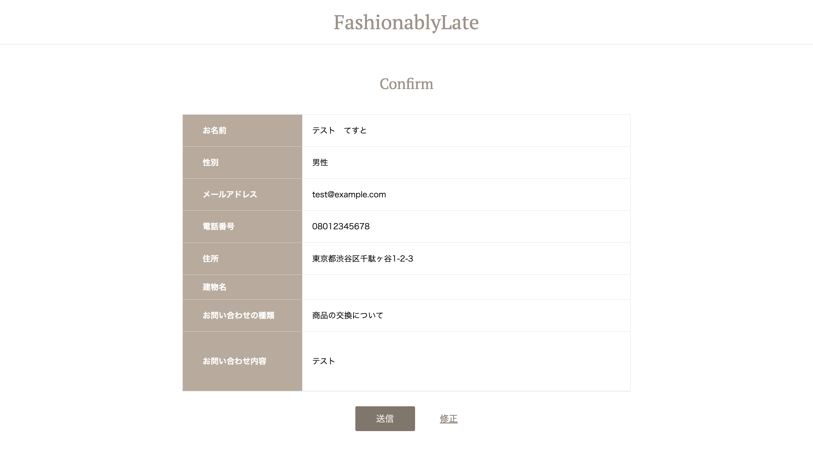
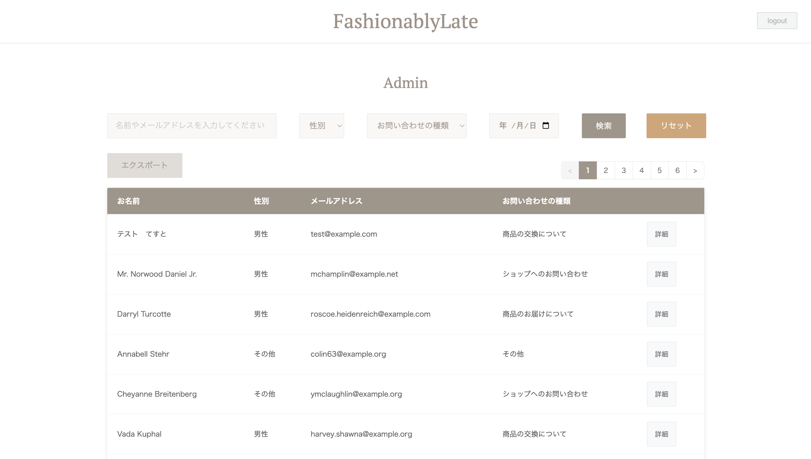
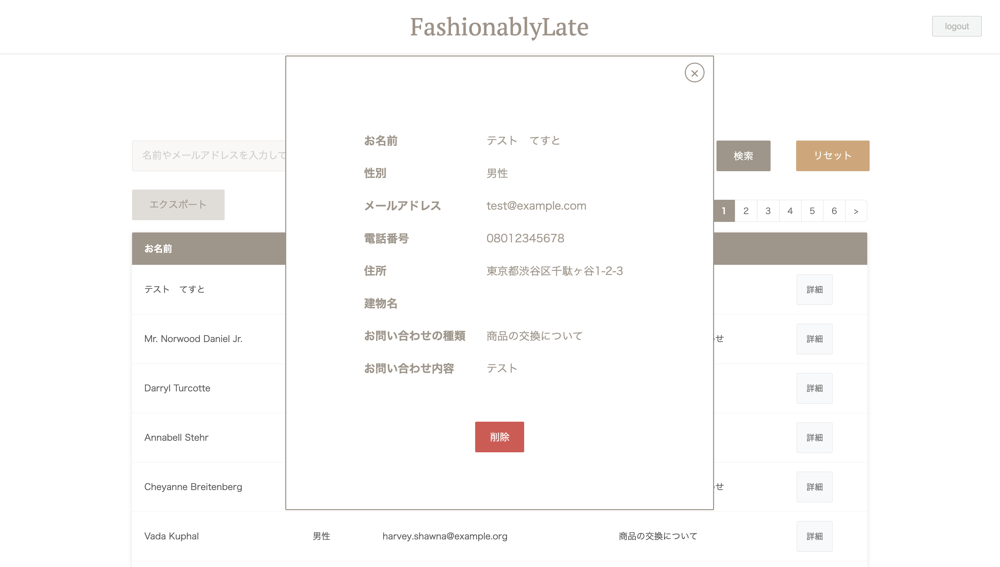

# Fashionably Late

## プロジェクト概要

Fashionably Lateは、お問い合わせの入力・確認・送信と、管理者向けのお問い合わせ管理機能を備えたLaravelアプリケーションです。

利用者は入力内容を確認してからお問い合わせを送信できます。管理者は認証後の管理画面で、お問い合わせの検索、詳細確認、削除、CSVエクスポートを行えます。

## 主な機能

### お問い合わせ

- お問い合わせ入力
- 入力確認
- 送信完了
- FormRequestによるバリデーション

### 管理者機能

- Laravel Fortifyによるログイン・ログアウト
- 認証済みユーザー向け管理画面
- 氏名・メールアドレス、性別、問い合わせ種別、日付による複合検索
- 1ページ7件のページネーション
- 詳細モーダル
- お問い合わせ削除
- 検索条件を反映したCSVエクスポート

### デモ・テスト

- Seeder / Factoryによるデモデータ生成
- デモ管理者アカウント
- 通常DBと分離した専用テストDB
- 主要機能を対象としたFeature Test

## 実装上のポイント

- 入力値の検証をFormRequestへ集約
- Laravel Fortifyによる認証とログイン試行回数制限
- `auth` middlewareによる管理画面、削除、CSV出力の保護
- 大量データを考慮し、CSVを500件ずつ取得してストリーミング出力
- Excelなどで文字化けしにくいUTF-8 BOM付きCSV
- 一覧、ページネーション、CSV間で検索条件を引き継ぐ構成
- カテゴリー、デモ管理者、デモ問い合わせを再利用する冪等なSeeder
- 通常DB `laravel_db` と専用テストDB `fashionablylate_test` の分離
- Feature Test 26件・84 assertionsで主要機能を検証

## 使用技術

| 技術 | バージョン・構成 |
| --- | --- |
| PHP | 8.1（Dockerfile: `php:8.1-fpm`） |
| Laravel | 8.83.29 |
| MySQL | 8.0.36 |
| Nginx | 1.21.1 |
| Composer | 2.8.11（確認済みビルド環境） |
| Laravel Fortify | 1.19.1 |
| PHPUnit | 9.6.25 |
| Mockery | 1.6.12 |
| 開発環境 | Docker / Docker Compose |

PHPのパッチバージョンはDockerfileで固定していないため、PHP 8.1と表記しています。

## 環境構築

### 前提

- Git
- Docker Desktopなど、Docker Composeを利用できる環境
- ポート80と8080が利用可能であること

### セットアップ

```bash
git clone https://github.com/aki11-20/fashionablylate.git
cd fashionablylate
```

Dockerコンテナをビルドして起動します。

```bash
docker compose up -d --build
```

PHPコンテナへ入ります。

```bash
docker compose exec php bash
```

PHPコンテナ内でLaravelをセットアップします。

```bash
composer install
cp .env.example .env
php artisan key:generate
php artisan migrate --seed
```

MySQLの起動直後に接続エラーになった場合は、MySQLの準備完了を少し待ってから `php artisan migrate --seed` を再実行してください。

画面で利用するCSSとJavaScriptは `public` 配下に配置済みで、ユーザーアップロード機能もないため、現在の構成では `npm install` と `php artisan storage:link` は不要です。

## デモ管理者

`php artisan migrate --seed` により、次のデモ管理者が作成されます。

| 項目 | 値 |
| --- | --- |
| メールアドレス | `admin@example.com` |
| パスワード | `password123` |

公開ユーザー登録は停止しているため、管理画面の確認にはこのアカウントを使用してください。

## Seeder

新規DBで `php artisan migrate --seed` を実行すると、次のデモデータが作成されます。

- カテゴリー：5件
- デモ管理者：1件
- デモ問い合わせ：35件

カテゴリーはカテゴリー名、管理者はメールアドレス、デモ問い合わせは予約済みの固定メールアドレスを識別子として再利用します。同じSeederを再実行しても、これらのデモデータは重複して増えません。

## URL

| 画面 | URL |
| --- | --- |
| お問い合わせ入力 | <http://localhost/> |
| 管理者ログイン | <http://localhost/login> |
| 管理画面 | <http://localhost/admin> |
| phpMyAdmin | <http://localhost:8080> |

## テスト

PHPUnitは通常DB `laravel_db` ではなく、専用DB `fashionablylate_test` を使用します。空のMySQLデータディレクトリからDockerを初期化する際に、テストDBと `laravel_user` の権限も自動作成されます。

ホスト側から次のコマンドを実行します。

```bash
docker compose exec php php artisan test
```

現在のテスト結果は次のとおりです。

```text
Tests: 26 passed
Assertions: 84
```

お問い合わせ、バリデーション、管理者認証、複合検索、詳細・削除、CSVエクスポートをFeature Testで確認しています。テストで使用する `RefreshDatabase` は `fashionablylate_test` に対してのみ実行されます。

## ER図

ポートフォリオ上の主要テーブルのみを記載しています。Laravel内部で使用する `migrations`、`password_resets`、`failed_jobs`、`personal_access_tokens` は省略しています。

現在の実装では `contacts.category` にカテゴリー名を保存しており、`users` と `contacts`、`categories` と `contacts` の間に外部キーはありません。そのため、存在しないリレーションは図示していません。



## スクリーンショット

| お問い合わせ入力 | 入力確認 |
| --- | --- |
|  |  |
| **管理画面** | **お問い合わせ詳細モーダル** |
|  |  |
