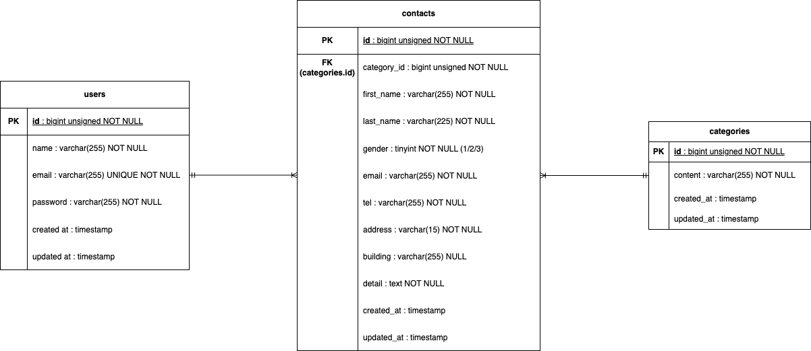

# Fashionably Late

## 環境構築

### リポジトリのクローン

1. git clone git@github.com:aki11-20/fashionablylate.git

### Docker ビルド・起動

2. docker-compose up -d --build

### PHP コンテナ

3. docker-compose exec php bash

### Laravel セットアップ

4. composer install
5. cp .env.example .env
6. php artisan key:generate

### マイグレーション＆シーディング

7. php artisan migrate --seed

## 使用技術

・ PHP 8.4.10
・ PHP(Docker コンテナ)8.1.33
・ Laravel 8.83.29
・ Composer 2.8.11
・ MySQL 8.0.36
・ Nginx 1.21.1

## ER 図

## URL

・ 開発環境: http://localhost/
・ phpMyAdmin: http://localhost:8080

